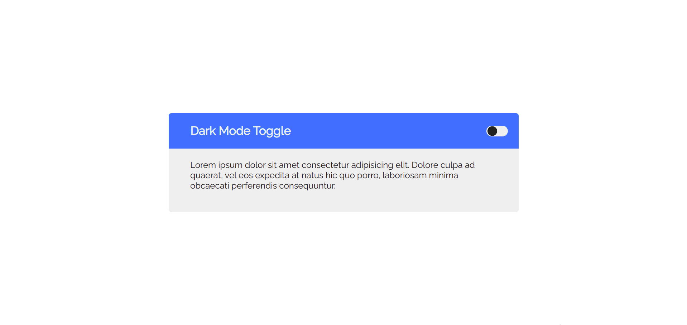

## JavaScript: Dark Mode Toggle

This project is an implementation of Dark Mode made in pure JavaScript.

As a small project, I tried to get things done in a simple and organized way. The implementation includes the LocalStorage to keep the user preferences even if the browser is closed or reloaded.

## Licence

This repository is released under the [**MIT License**](LICENSE).

## From me to you

Hi, my name is **Felipe!**

I'm a Front-End student who wants to share my learning with the community, helping other devs in the same situation.

At the moment I'm studying by myself in 💻 online courses, 📄 reading the documentation, and 💪 hard practicing every day. So if I can, **you could too!**

I hope you've enjoyed this repository and have helped you in some way.

Thanks for checking out and have good learning 😉"

## Contributors

[feliperdamaceno](https://github.com/feliperdamaceno/)

## Contact me

Linkedin: [feliperdamaceno](https://www.linkedin.com/in/feliperdamaceno/)
